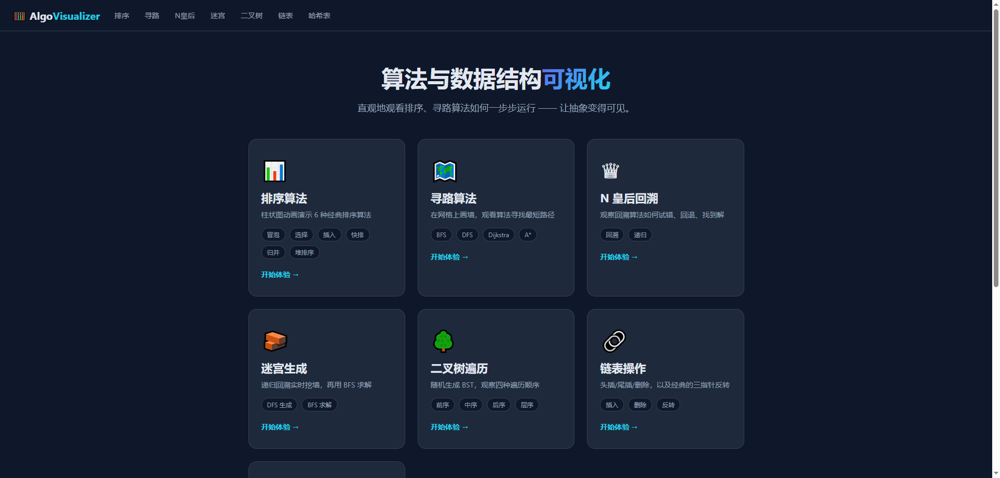
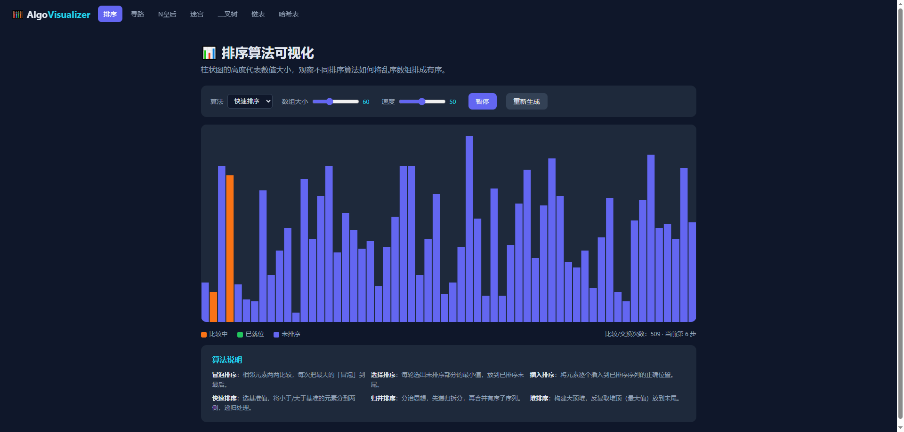
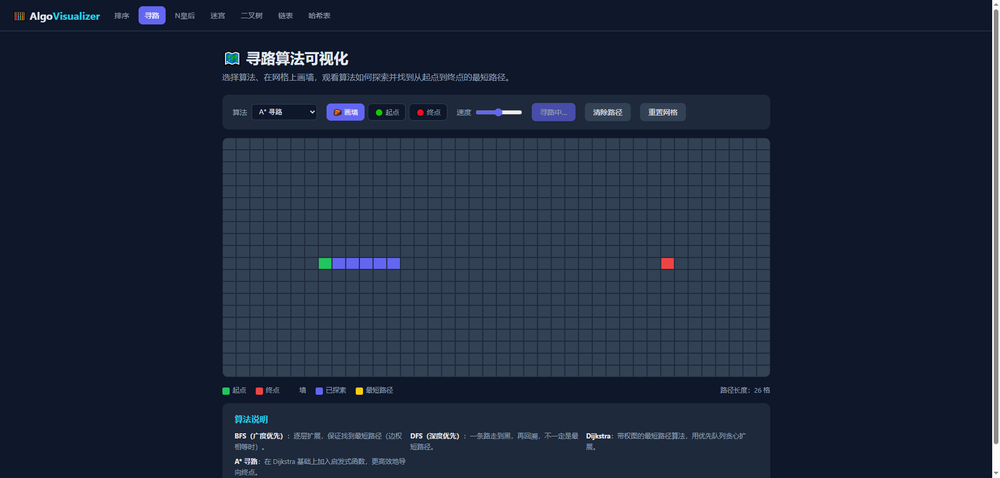
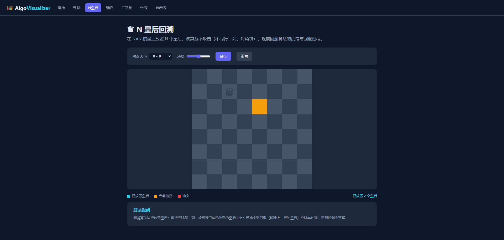
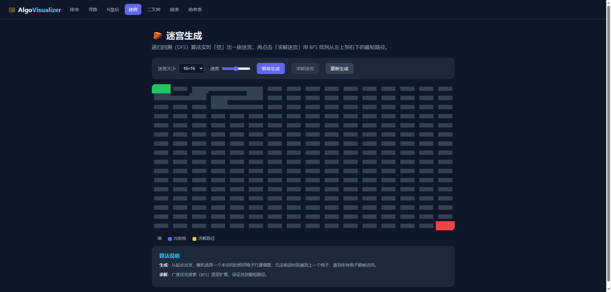
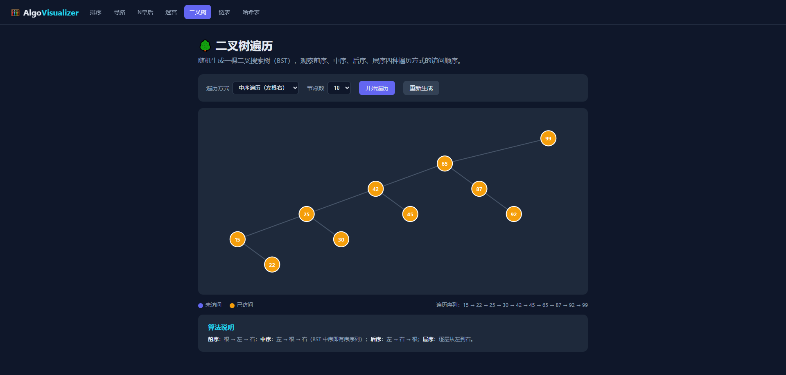
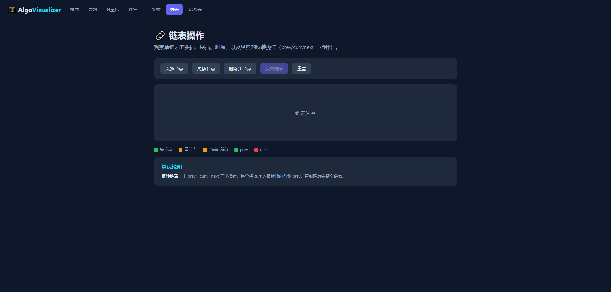
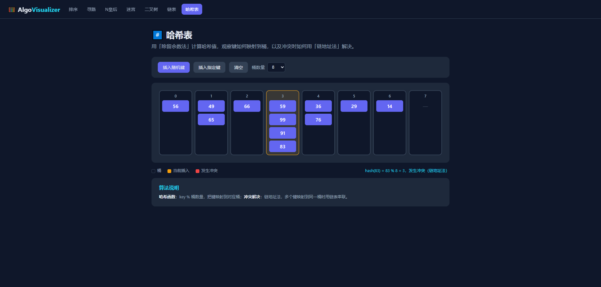

# 我用 Vue3 手写了一个算法可视化平台：12+ 种算法动起来，在线可玩！

> **在线体验**：https://2013520010.github.io/algo-visualizer/
> **GitHub 源码**：https://github.com/2013520010/algo-visualizer
> 如果觉得不错，欢迎点个 ⭐ Star，你的支持是我持续更新的动力！

---

## 一、前言：为什么我想做这个项目

相信每一个程序员在学习算法的过程中，都经历过这样的痛苦：书上的伪代码看了一遍又一遍，脑子里还是想象不出「归并排序到底怎么合并的」「A* 算法为什么要用启发式函数」「回溯到底是怎么回退的」。

算法最大的难点，从来不是代码本身，而是**理解它的执行过程**。

我至今记得自己当年第一次学「快速排序」时的困惑：什么基准值？什么分区？书上的文字和静态的配图翻来覆去，始终无法在脑海中形成连贯的画面。后来我偶然看到一个国外的排序动画网站，看着那些柱子飞快地移动、归位，短短几十秒，困扰我许久的快排原理瞬间就通了。

那一刻我意识到：**文字是静态的，代码是抽象的，而动画是直观的**。

于是我萌生了一个想法：为什么不自己动手，用现代前端技术做一个完整的、覆盖更多算法的可视化平台呢？既可以帮助自己加深理解，也能帮助无数正在算法苦海中挣扎的初学者。

经过一段时间的打磨，我用 **Vue 3** 从零写出了一个 **Algo Visualizer（算法可视化平台）**，把 12+ 种经典算法和数据结构全部「动」了起来：你可以亲眼看到冒泡排序的「大泡泡」一个个浮上来、看到 A* 算法如何一步步逼近终点、看到 N 皇后如何试错又回退、看到链表如何一步步反转。所有过程都可以调速、暂停、反复观看。

**这个项目是在 AI 辅助下完成的**。从技术选型、代码框架搭建、算法实现，到界面设计和 bug 排查，我都大量借助了 AI 工具——AI 帮我快速产出代码骨架、生成重复性的样板代码、分析性能瓶颈，而我的角色则更多是**把握方向、审查每一处实现、确保自己真正理解了背后的原理**。

这次经历也让我重新思考了 AI 时代程序员的竞争力：它不再比拼「码代码」的速度，而是比拼「驾驭 AI 写出正确代码」的能力。AI 是生产力放大器，但算法原理、架构设计、性能优化这些「内功」，依然需要人去理解、去决策、去把关。

这篇文章我会**极其详细**地介绍这个项目——每一个算法的原理、复杂度、可视化看点，以及背后的核心技术实现。全文较长（约一万两千字），建议先收藏，慢慢看。文末有完整的在线体验地址和源码地址。

---

## 二、项目概览

### 2.1 一句话介绍

一个**纯前端**、**交互式**的算法与数据结构可视化平台，用 Canvas / SVG / DOM 三种渲染方式，把排序、寻路、回溯、二叉树、链表、哈希表等 12+ 种算法做成实时动画。

### 2.2 核心亮点

| 亮点 | 说明 |
|------|------|
| 🎯 **纯前端** | 无后端依赖，可直接部署到 GitHub Pages / Vercel |
| 🎨 **三种渲染方式** | Canvas（排序/寻路/迷宫）、SVG（二叉树）、DOM（链表/哈希表），按需选择 |
| ⚡ **可调速动画** | 速度滑块自由调节，暂停/继续/重置 |
| 🧩 **12+ 种算法** | 排序 6 种、寻路 4 种、回溯 2 种、数据结构 3 类 |
| 🌙 **暗色主题** | 现代化暗色 UI，60fps 流畅渲染 |
| 🎮 **强交互性** | 自由画墙、拖动起终点、调节数组大小 |

### 2.3 支持的功能清单

- **排序算法（6 种）**：冒泡、选择、插入、快速、归并、堆排序
- **寻路算法（4 种）**：BFS、DFS、Dijkstra、A*
- **回溯算法**：N 皇后、迷宫生成（DFS 递归回溯）
- **数据结构**：二叉树遍历（前/中/后/层序）、链表操作（插入/删除/反转）、哈希表（链地址法）

### 2.4 技术栈

| 技术 | 用途 |
|------|------|
| Vue 3 | 组合式 API + `<script setup>` |
| Vite 5 | 构建工具 |
| Vue Router 4 | 哈希路由 |
| Canvas 2D | 像素级动画渲染 |
| SVG | 树形结构渲染 |
| CSS3 | 暗色主题、DOM 动画 |
| GitHub Actions | 自动部署到 GitHub Pages |

### 2.5 项目首页截图



可以看到首页以卡片形式展示所有功能模块，点击卡片即可进入对应的可视化页面。

---

## 三、排序算法可视化：让「比较与交换」一目了然

排序是算法入门的必修课，也是面试的必考题。这个模块用**柱状图**表示数组（柱子越高值越大），用**颜色**区分状态：

- 🔵 蓝色：未排序
- 🟠 橙色：正在比较 / 交换
- 🟢 绿色：已经排好（就位）

你可以调节数组大小（10~150）、切换算法、调节速度。下面逐一详解这 6 种排序算法。



> 图中是快速排序运行中的状态：绿色柱子是已经「就位」的元素，橙色是正在比较的元素，蓝色是未排序元素。

### 3.1 冒泡排序（Bubble Sort）

**核心思想**：重复遍历数组，相邻元素两两比较，如果顺序错了就交换。每一轮遍历都会把当前未排序部分的最大值「冒泡」到最后。

**伪代码**：
```
for i = 0 to n-2:
    for j = 0 to n-i-2:
        if a[j] > a[j+1]:
            swap(a[j], a[j+1])
    // 第 n-i-1 个元素已就位
```

**复杂度分析**：
- 时间复杂度：最坏 / 平均 O(n²)，最好（已有序，且加了提前退出优化时）O(n)
- 空间复杂度：O(1)，原地排序
- 稳定性：稳定（相等元素不会交换）

**为什么最坏是 O(n²)**：n 个元素需要 n-1 轮，每轮最多比较 n-1 次，所以约 (n-1)² 次比较。

**可视化看点**：你会看到最大的柱子像气泡一样，一轮一轮「浮」到数组末尾，绿色（已就位）区域从右往左逐渐扩大。

### 3.2 选择排序（Selection Sort）

**核心思想**：每一轮从未排序部分「扫描」出最小值，把它放到已排序部分的末尾。

**伪代码**：
```
for i = 0 to n-2:
    minIdx = i
    for j = i+1 to n-1:
        if a[j] < a[minIdx]:
            minIdx = j
    swap(a[i], a[minIdx])
```

**复杂度分析**：
- 时间复杂度：恒为 O(n²)（无论数组是否有序，都要扫描找最小值）
- 空间复杂度：O(1)
- 稳定性：不稳定（跨元素交换可能打乱相等元素的相对顺序）

**可视化看点**：每一轮先「扫描」找到最小柱子（橙色高亮在候选最小值上跳动），然后一次性把它换到前面。特点是**交换次数少**（每轮最多一次，总共 n-1 次），但**比较次数固定**为 n(n-1)/2 次。

### 3.3 插入排序（Insertion Sort）

**核心思想**：像整理扑克牌一样，把每个元素「插入」到已排序部分的正确位置。

**伪代码**：
```
for i = 1 to n-1:
    key = a[i]
    j = i - 1
    while j >= 0 and a[j] > key:
        a[j+1] = a[j]   // 右移
        j = j - 1
    a[j+1] = key       // 插入
```

**复杂度分析**：
- 时间复杂度：最坏 / 平均 O(n²)，最好（已有序）O(n)
- 空间复杂度：O(1)
- 稳定性：稳定

**为什么接近有序时很快**：当数组基本有序时，内层 while 循环几乎不执行，复杂度趋近 O(n)。这也是为什么希尔排序、以及某些工程排序（如 TimSort）会用到插入排序。

**可视化看点**：已排序部分（左侧）始终保持有序，新元素「插入」时会把比它大的元素逐个右移，形成一段「多米诺骨牌」式的移动效果。

### 3.4 快速排序（Quick Sort）

**核心思想**：分治法。选一个基准值（pivot），把小于它的放左边、大于它的放右边（这个过程叫「分区」），再递归处理左右两边。

**伪代码**（Lomuto 分区）：
```
function quickSort(lo, hi):
    if lo < hi:
        pi = partition(lo, hi)
        quickSort(lo, pi-1)
        quickSort(pi+1, hi)

function partition(lo, hi):
    pivot = a[hi]
    i = lo - 1
    for j = lo to hi-1:
        if a[j] < pivot:
            i = i + 1
            swap(a[i], a[j])
    swap(a[i+1], a[hi])
    return i + 1
```

**复杂度分析**：
- 时间复杂度：平均 O(n log n)，最坏 O(n²)（当数组已有序或逆序，且基准值选择不当时会退化为最坏情况）
- 空间复杂度：O(log n)（递归调用栈）
- 稳定性：不稳定

**为什么平均是 O(n log n)**：每一层递归把数组「一分为二」，递归深度约 log n 层，每层处理 n 个元素。

**可视化看点**：基准值（pivot，最右侧）和当前扫描的元素会被高亮，你能清楚看到「分区」过程——左边逐渐聚拢所有小于基准的柱子，右边都是大于基准的，最后基准被「插」到中间的正确位置。

### 3.5 归并排序（Merge Sort）

**核心思想**：分治法。先把数组递归地「拆」成单个元素，再两两「合并」成有序序列。

**伪代码**：
```
function mergeSort(lo, hi):
    if lo >= hi: return
    mid = (lo + hi) / 2
    mergeSort(lo, mid)
    mergeSort(mid+1, hi)
    merge(lo, mid, hi)   // 合并两个有序子数组
```

**复杂度分析**：
- 时间复杂度：恒为 O(n log n)（最坏、最好、平均都一样）
- 空间复杂度：O(n)（需要辅助数组）
- 稳定性：稳定

**为什么恒为 O(n log n)**：不管数据怎么分布，递归深度固定是 log n，每层合并固定处理 n 个元素。这是归并排序最大的优点——性能极其稳定，不会像快排那样退化。

**可视化看点**：能看到「先拆后合」的完整过程，合并阶段两个有序子序列如何逐元素比较、归并成一个更大的有序序列。归并的「写回」过程（橙色的单格高亮）非常直观。

### 3.6 堆排序（Heap Sort）

**核心思想**：把数组构造成「大顶堆」（父节点大于等于子节点的完全二叉树），反复取堆顶（最大值）放到数组末尾，再调整堆。

**伪代码**：
```
// 建堆
for i = n/2-1 downto 0:
    heapify(n, i)
// 排序
for i = n-1 downto 1:
    swap(a[0], a[i])   // 堆顶（最大）放到末尾
    heapify(i, 0)      // 调整剩余堆
```

**复杂度分析**：
- 时间复杂度：恒为 O(n log n)（建堆 O(n)，每次调整 O(log n)，共 n 次）
- 空间复杂度：O(1)，原地排序
- 稳定性：不稳定

**可视化看点**：能看到堆的构建和「下沉」（heapify）调整过程，堆顶（最大值）不断被「摘」下来放到数组末尾。堆排序是少数「原地 + O(n log n)」的排序，这是它的独特价值。

### 3.7 六大排序算法横向对比

| 算法 | 最好 | 平均 | 最坏 | 空间 | 稳定性 |
|------|------|------|------|------|--------|
| 冒泡排序 | O(n) | O(n²) | O(n²) | O(1) | 稳定 |
| 选择排序 | O(n²) | O(n²) | O(n²) | O(1) | 不稳定 |
| 插入排序 | O(n) | O(n²) | O(n²) | O(1) | 稳定 |
| 快速排序 | O(n log n) | O(n log n) | O(n²) | O(log n) | 不稳定 |
| 归并排序 | O(n log n) | O(n log n) | O(n log n) | O(n) | 稳定 |
| 堆排序 | O(n log n) | O(n log n) | O(n log n) | O(1) | 不稳定 |

> **小技巧**：把速度调到最低，你会看清每一个比较和交换动作；把速度拉到最高，则能直观感受不同算法在规模相同的数据上「快慢」的巨大差异——快速排序和归并排序明显比冒泡、选择、插入快一个数量级。这种「亲眼所见」的对比，比背复杂度表格印象深刻得多。

---

## 四、寻路算法可视化：在网格上寻找最短路径

这是整个项目里**最受欢迎、最惊艳**的模块。你可以在网格上**自由画墙**（障碍物）、**拖动起点和终点**，然后让算法自己探索，找到一条从起点到终点的路径。探索过的格子会变成蓝色（靛蓝），最终路径会高亮成黄色。



> 图中是 A* 算法的运行结果：靛蓝色是已探索的区域，黄色是从起点（绿）到终点（红）找到的最短路径，黑色是用户手动画的墙。

### 4.1 BFS（广度优先搜索）

**核心思想**：用队列，逐层向外扩展。先访问离起点 1 步的所有格子，再访问 2 步的，以此类推。

**伪代码**：
```
queue = [start]
visited = {start}
while queue 不为空:
    cur = queue.dequeue()
    if cur == end: break
    for nb in cur的相邻格子:
        if nb 未访问且不是墙:
            visited.add(nb)
            queue.enqueue(nb)
```

**特点**：在**边权相等**的图中，BFS **保证**找到最短路径（因为它是按「离起点的步数」逐层访问的，第一次访问到终点时经过的步数一定最少）。

**复杂度**：O(V + E)，V 是格子数，E 是边数。

**可视化看点**：探索区域像「水波纹」一样从起点均匀向外扩散，非常直观、非常漂亮。

### 4.2 DFS（深度优先搜索）

**核心思想**：用栈，一条路走到黑，走不通了再回溯。

**伪代码**：
```
stack = [start]
visited = {start}
while stack 不为空:
    cur = stack.pop()
    if cur == end: break
    for nb in cur的相邻格子:
        if nb 未访问且不是墙:
            visited.add(nb)
            stack.push(nb)
```

**特点**：**不一定**找到最短路径（可能绕远路），但实现简单，占用空间小（只需存一条路径）。

**复杂度**：O(V + E)。

**可视化看点**：探索轨迹像「蛇」一样蜿蜒前进，钻到死胡同再退回来，视觉上非常有辨识度。对比 BFS 的均匀扩散，你能直观理解「栈」和「队列」这两种数据结构带来的根本差异。

### 4.3 Dijkstra 算法

**核心思想**：贪心 + 优先队列。每次从「未确定最短距离」的节点中，选出**距离起点最近**的节点，用它去「松弛」（更新）邻居的距离。

**伪代码**：
```
dist[start] = 0
pq = 优先队列，按 dist 排序，初始只有 start
while pq 不为空:
    cur = pq.pop()   // 取出 dist 最小的
    for nb in cur的相邻格子:
        newDist = dist[cur] + 1   // 网格边权为 1
        if newDist < dist[nb]:
            dist[nb] = newDist
            pq.push(nb)
```

**特点**：适用于**带权图**，能找到单源最短路径。在网格（边权都为 1）场景下，Dijkstra 退化为「带权 BFS」，但它的精髓在于**优先队列**——总是优先处理「当前看起来最近」的节点。

**复杂度**：O((V + E) log V)（用二叉堆实现优先队列时）。

**可视化看点**：你能看到「已确定最短距离」的区域如何像涨潮一样慢慢铺开。优先队列让探索总是优先靠近起点的方向，而不是像 BFS 那样严格按层扩散。

### 4.4 A* 寻路算法

**核心思想**：在 Dijkstra 的基础上，加入**启发式函数** h(n)（这里用曼哈顿距离：到终点的横向格子数 + 纵向格子数），用 f(n) = g(n) + h(n) 决定探索优先级，让搜索「有方向性地」朝终点推进。

- g(n)：起点到当前格的实际代价
- h(n)：当前格到终点的**估计**代价（曼哈顿距离）
- f(n) = g(n) + h(n)：总估计代价

**伪代码**：
```
gScore[start] = 0
pq 按 f = g + h 排序
while pq 不为空:
    cur = pq.pop()
    if cur == end: break
    for nb in cur的相邻格子:
        tentative = gScore[cur] + 1
        if tentative < gScore[nb]:
            gScore[nb] = tentative
            pq.push(nb, tentative + h(nb))
```

**特点**：在多数情况下比 Dijkstra **快得多**（因为有了方向感），且当启发式满足「可采纳性」（不高估）时，同样能找到最短路径。

**复杂度**：取决于启发式质量，最坏退化为 Dijkstra 的 O((V+E) log V)，实际通常远优于它。

**可视化看点**：A* 的探索区域明显「偏向终点方向」，像被目标「吸引」一样快速逼近。对比 BFS 的均匀扩散、DFS 的乱窜、Dijkstra 的稳步铺开，差异一目了然——这也是理解 A* 为什么高效的最好方式。

### 4.5 四种寻路算法横向对比

| 算法 | 是否保证最短 | 是否有方向感 | 数据结构 | 适用场景 |
|------|-------------|-------------|---------|---------|
| BFS | ✅（边权相等） | ❌ 均匀扩散 | 队列 | 无权图最短路径 |
| DFS | ❌ | ❌ 一条路到底 | 栈 | 拓扑排序、连通性 |
| Dijkstra | ✅ | 部分（按距离） | 优先队列 | 带权图最短路径 |
| A* | ✅（启发式可采纳时） | ✅ 强 | 优先队列 | 有明确终点的寻路 |

> 强烈建议你亲手对比这四种算法：画同样的墙、设同样的起终点，切换算法再跑一遍，你会对「搜索策略」有全新的理解。尤其是 BFS vs A* 的对比，堪称理解启发式搜索的「第一课」。

---

## 五、回溯算法：见证「试错与回退」的艺术

回溯是解决「组合 / 排列 / 棋盘类」问题的万能框架，但它的执行过程往往最难脑补。这个模块把回溯的「尝试 → 失败 → 回退」过程完整呈现出来。

### 5.1 N 皇后问题

**问题描述**：在 N×N 的棋盘上放置 N 个皇后，要求任意两个皇后**不在同一行、同一列、同一条对角线**上。

**核心思想**：按行放置皇后，每一行尝试每一列：
1. 检查当前格是否与已放置的皇后冲突（同列、同对角线）
2. 不冲突就放置，进入下一行
3. 冲突就尝试下一列
4. 一行所有列都失败，就**回退**到上一行，换一列继续

**冲突判断技巧**：两个皇后 (r1, c1) 和 (r2, c2) 冲突，当且仅当：
- 同列：c1 == c2
- 同对角线：|c1 - c2| == |r1 - r2|（斜率绝对值为 1）

**可视化看点**：
- 橙色格子是「当前正在检查」的位置
- 红色高亮是「与当前格冲突」的皇后（即放置会失败的原因）
- 你会看到皇后被放上去、发现冲突、又被撤下来，如此反复，直到找到完整解

**复杂度**：最坏 O(n!)，但由于大量剪枝（冲突就跳过），实际远低于此。N=8 时共有 92 个解。



> 图中是 8 皇后已求解完成的状态，8 个皇后互不攻击。

### 5.2 迷宫生成（DFS 递归回溯）

**核心思想**：用「递归回溯法」（也叫 DFS 挖墙法）生成迷宫：
1. 从起点格子出发，标记为已访问
2. 随机选择一个**未访问**的相邻格子，打通它们之间的墙，移动到新格子
3. 重复，直到当前格没有未访问的相邻格子
4. 此时**回溯**到上一个格子，继续尝试其他方向
5. 直到所有格子都被访问

**可视化看点**：你会看到「当前格」（蓝色）在迷宫里钻来钻去，挖出一条条通道；走到死路就退回上一个分岔口继续挖。生成完成后，还能点击「求解迷宫」，用 **BFS** 找到从左上角到右下角的最短路径（黄色高亮）。

**复杂度**：O(行数 × 列数)，即每个格子恰好访问一次。生成的迷宫有一个重要性质：**任意两个格子之间有且仅有一条路径**（即迷宫是「完美迷宫」，没有环）。



> 图中是已生成并求解完成的迷宫：黑色是墙，黄色是从左上角到右下角的最短路径。

---

## 六、数据结构可视化：让抽象结构「现出原形」

如果说排序和寻路是「过程可视化」，那数据结构模块就是「结构可视化」——把链表、树、哈希表这些看不见摸不着的抽象结构，直接画出来。

### 6.1 二叉树遍历（Binary Tree）

**核心思想**：随机生成一棵**二叉搜索树（BST）**（左子树 < 根 < 右子树），然后用四种方式遍历。

**BST 的构建**：
```javascript
function insert(root, value) {
  if (!root) return new TreeNode(value)
  if (value < root.value) root.left = insert(root.left, value)
  else root.right = insert(root.right, value)
  return root
}
```

**四种遍历**：

| 遍历方式 | 访问顺序 | 典型用途 |
|---------|---------|---------|
| 前序遍历 | 根 → 左 → 右 | 复制树、序列化 |
| 中序遍历 | 左 → 根 → 右 | **BST 中序结果即有序序列** |
| 后序遍历 | 左 → 右 → 根 | 删除树、计算子树大小 |
| 层序遍历 | 逐层从左到右 | 求树的高度、判断完全二叉树 |

**可视化看点**：树用 SVG 绘制，节点是圆、边是连线。点击「开始遍历」，节点会按访问顺序**逐个变橙**，你能清楚看到前序「先访问根」和中序「先访问最左下」的区别。尤其是中序遍历，你会发现访问顺序正好是**从小到大**——这是 BST 最神奇、也最值得记住的性质。



> 图中是二叉搜索树（BST）的中序遍历进行中的状态，橙色的节点是已经访问过的节点。

### 6.2 链表操作（Linked List）

**核心思想**：用带指针箭头的节点盒子展示单链表，演示三个经典操作：

- **头插 / 尾插**：在头部 / 尾部插入新节点
- **删除头节点**：删除链表第一个节点
- **反转链表**：最经典的链表题

**反转链表的实现**（LeetCode 206 题）：
```javascript
let prev = null
let curr = head
while (curr) {
  const next = curr.next   // 1. 先保存下一个节点
  curr.next = prev         // 2. 反转当前节点的指向
  prev = curr              // 3. prev 前进
  curr = next              // 4. curr 前进
}
return prev
```

**可视化看点**：反转动画是精华——绿色是 prev 指针、橙色是 curr 指针、红色是 next 指针，三个指针像「接力」一样依次向后移动，每移动一步就反转一个节点的指向，直到整个链表反转完成。这个动画对理解「三指针反转」帮助极大。



> 图中是链表反转进行中的状态，绿色、橙色、红色分别标记了 prev、curr、next 三个指针。

### 6.3 哈希表（Hash Table）

**核心思想**：演示哈希表的两大核心机制——**哈希函数**和**冲突解决**：

- **哈希函数**：采用「除留余数法」`hash(key) = key % 桶数量`，把键映射到对应的桶
- **冲突解决**：采用「链地址法」，多个键映射到同一个桶时，用链表（链）串联起来

**除留余数法的实现**：
```javascript
function hash(key, size) {
  return ((key % size) + size) % size
}
```

**可视化看点**：插入一个键时，对应的桶会高亮，状态栏会实时显示 `hash(42) = 42 % 8 = 2` 这样的计算过程。当两个键算出同一个桶下标时，会提示「发生冲突」，新键就「挂」在已有键的下方——链地址法的原理一目了然。

**关于哈希表，你需要知道的**：
- 哈希函数的目标是「把键均匀地分散到各个桶」
- 冲突不可避免，关键在于如何高效解决
- 常见的冲突解决方式：链地址法（本项目）、开放寻址法（线性探测、二次探测）



> 图中是插入了 12 个随机键后的哈希表，可以看到部分桶里「挂」了多个键（链地址法解决冲突）。

---

## 七、核心技术实现：一个值得借鉴的架构

这个项目不仅「好看」，代码结构也值得学习。下面分享几个关键的技术设计，以及背后的思考。

### 7.1 步骤分离设计（最重要的设计）

这是整个项目架构的精髓，也是最值得借鉴的地方。核心思想是：**算法只负责生成「步骤序列」，渲染层再逐步回放**。

以排序为例，算法函数不直接操作 DOM / Canvas，而是返回一个步骤数组：

```javascript
// 冒泡排序：生成步骤，而不是直接动画
export function bubbleSort(input) {
  const a = [...input]
  const sorted = []
  const steps = []
  const n = a.length
  for (let i = 0; i < n - 1; i++) {
    for (let j = 0; j < n - i - 1; j++) {
      steps.push(makeStep(a, sorted, [j, j+1]))   // 记录「比较」
      if (a[j] > a[j+1]) {
        ;[a[j], a[j+1]] = [a[j+1], a[j]]
        steps.push(makeStep(a, sorted, [j, j+1])) // 记录「交换」
      }
    }
    sorted.push(n - 1 - i)
    steps.push(makeStep(a, sorted))               // 记录「已就位」
  }
  return steps
}
```

渲染层拿到 `steps` 后，用 `requestAnimationFrame` 逐步回放。这个设计带来三大好处：

1. **解耦**：算法逻辑与渲染逻辑彻底分离。算法层是纯函数、无副作用，可以单独写单元测试；渲染层只关心「如何画」，不关心「算法怎么算」。
2. **可调速 / 可暂停**：因为步骤是离散的，速度控制就简化为「每帧推进多少步」。
3. **可回放 / 可跳转**：步骤是纯数据，理论上可以轻松实现进度条拖拽、单步执行、倒放等功能。

同样的设计也应用在寻路（记录访问顺序 + 最终路径）、N 皇后（记录放置/移除）、迷宫（记录挖墙）等所有模块中。

### 7.2 Canvas 渲染与动画控制

排序、寻路、N 皇后、迷宫都用 Canvas 2D 渲染，配合 `requestAnimationFrame` 实现 60fps 动画。

**速度控制的核心**——用一个「步进累加器」实现与帧率无关的平滑调速：

```javascript
function tick() {
  if (!playing.value) return
  // 速度 1-100 → 每帧推进 0.025 - 2.5 步
  stepAccumulator += speed.value / 40
  const advance = Math.floor(stepAccumulator)
  if (advance > 0) {
    stepAccumulator -= advance
    currentStep.value += advance   // 一次可推进多步
    if (currentStep.value >= steps.value.length - 1) {
      currentStep.value = steps.value.length - 1
      stopAnimation()
    }
  }
  draw()
  rafId = requestAnimationFrame(tick)
}
```

这个设计的好处是：**即使用户在动画过程中拖动速度滑块，也能实时生效**，无需重启动画。累加器会把「小数步」累积起来，速度高时一帧推进多步，速度低时多帧才推进一步，动画始终流畅。

**关于 Canvas 的高清适配**：项目中用了 `devicePixelRatio` 处理高分屏（Retina 屏）模糊问题：

```javascript
const dpr = window.devicePixelRatio || 1
canvas.width = w * dpr
canvas.height = h * dpr
ctx.scale(dpr, dpr)
```

否则在高分屏上，Canvas 画出来的内容会显得模糊。

### 7.3 手写优先队列（二叉堆）

寻路的 Dijkstra 和 A* 都需要优先队列。我没有用现成的库，而是手写了一个**二叉最小堆**：

```javascript
class MinHeap {
  constructor() { this.heap = [] }
  push(item) {
    this.heap.push(item)
    this.bubbleUp(this.heap.length - 1)  // 上浮
  }
  pop() {
    const top = this.heap[0]
    const last = this.heap.pop()
    if (this.heap.length > 0) {
      this.heap[0] = last
      this.bubbleDown(0)                 // 下沉
    }
    return top
  }
  isEmpty() { return this.heap.length === 0 }
}
```

Dijkstra 按「到起点的距离 g」排序，A* 按「f = g + h」排序，两者共用同一个堆结构，只是「优先级」的计算方式不同——这正是 A* 是 Dijkstra 的超集这一关系的体现。

手写堆虽然只有几十行，但它体现了对**堆这种数据结构**的真正理解：用数组存完全二叉树、父节点下标 `(i-1)/2`、左右子节点 `2i+1` / `2i+2`、插入时上浮、删除时下沉。

### 7.4 三种渲染方式各司其职

不同数据结构选不同渲染层，体现了「按需选择」的工程思维：

| 场景 | 渲染方式 | 原因 |
|------|---------|------|
| 排序 / 寻路 / N皇后 / 迷宫 | Canvas | 大量像素级操作，需 60fps 性能 |
| 二叉树 | SVG | 需要画「节点 + 连线」，SVG 更自然，且可绑定事件 |
| 链表 / 哈希表 | DOM | 盒子 + 箭头结构简单，DOM 更易布局和加 CSS 动画 |

这个选择不是随意的：排序场景有几百个柱子、寻路场景有几百个格子，用 DOM 会卡顿，用 Canvas 才流畅；而二叉树需要「连线」，Canvas 画线要手动算坐标，SVG 用 `<line>` 标签更简洁；链表和哈希表元素少、结构简单，DOM 加上 CSS transition 就能做出漂亮的动画。

### 7.5 响应式与暗色主题

整个界面采用 CSS 变量实现暗色主题，一行 `:root` 定义主题色，全局复用：

```css
:root {
  --bg: #0f172a;          /* 深蓝黑背景 */
  --bg-card: #1e293b;     /* 卡片背景 */
  --primary: #6366f1;     /* 主色（靛蓝） */
  --accent: #22d3ee;      /* 强调色（青色） */
  --text: #e2e8f0;        /* 主文字 */
  --text-muted: #94a3b8;  /* 次要文字 */
}
```

Canvas 的尺寸根据容器宽度动态计算，配合 `window.resize` 监听实现响应式，在不同屏幕尺寸下都能正常显示。

---

## 八、项目结构

整个项目结构清晰，算法逻辑与渲染组件分离：

```
algo-visualizer
├── .github/workflows/
│   └── deploy.yml         # GitHub Actions 自动部署
└── src/
    ├── algorithms/        # 算法核心（纯逻辑，无渲染）
    │   ├── sorting.js     # 6 种排序算法
    │   ├── pathfinding.js # 4 种寻路算法 + 优先队列
    │   ├── backtracking.js# N 皇后回溯
    │   ├── maze.js        # 迷宫生成 + 求解
    │   ├── tree.js        # 二叉树 + 遍历
    │   ├── linkedlist.js  # 链表操作
    │   └── hashtable.js   # 哈希表
    ├── components/        # 各算法可视化组件（渲染层）
    │   ├── SortingVisualizer.vue
    │   ├── PathfindingVisualizer.vue
    │   ├── NQueensVisualizer.vue
    │   ├── MazeVisualizer.vue
    │   ├── BinaryTreeVisualizer.vue
    │   ├── LinkedListVisualizer.vue
    │   └── HashTableVisualizer.vue
    ├── views/             # 页面（首页 + 7 个可视化页）
    ├── router/            # 路由
    └── styles/            # 全局样式
```

---

## 九、开发过程中的踩坑与思考

写这个项目的过程中，我也踩了不少坑，分享几个比较有代表性的，希望能给同样想做的朋友一些启发。

### 坑 1：排序动画「闪烁」问题

最初我用 DOM（一堆 div）来渲染排序的柱子，结果数据量一大（超过 50 个柱子）就卡顿、闪烁。原因是**频繁的 DOM 更新会触发浏览器重排（reflow）**。

**解决**：改用 Canvas 渲染。Canvas 是「画布」模型，只做像素级的绘制，不会触发重排，轻松跑到 60fps。

### 坑 2：动画速度与帧率的耦合

最初的实现是用 `setTimeout` 控制「每一步」的间隔，结果发现：在帧率不稳定的设备上，动画忽快忽慢。

**解决**：改用 `requestAnimationFrame` + 步进累加器。`requestAnimationFrame` 由浏览器按屏幕刷新率（通常 60Hz）调度，累加器把「该推进多少步」按时间精确累积，实现了与帧率无关的稳定动画。

### 坑 3：归并排序的「原地性」误解

归并排序需要辅助数组，一开始我试图「原地归并」，结果实现复杂且容易出错。后来想通了：**归并排序本来就是 O(n) 空间复杂度**，用辅助数组才是正道。可视化中，我通过「写回」动作（橙色单格高亮）来展示辅助数组如何写回原数组。

### 坑 4：迷宫求解的「墙」判断

生成迷宫后，我用 BFS 求解，结果发现 BFS 老是「穿墙」。排查后发现：我判断「能否从 A 走到 B」时，只检查了 A 到 B 方向的墙，忘了 B 到 A 方向也要一致。迷宫里两面墙必须**同时打通**，否则单向通行会导致 BFS 结果错误。

### 心得

这些坑看似琐碎，但每一个都对应着一个真实的技术知识点（重排与重绘、requestAnimationFrame、归并排序的空间复杂度、迷宫的数据结构设计）。**做可视化项目的过程，本身就是在加深对算法的理解**。

顺带一提，即使有 AI 辅助，这些坑也一个都没少踩——AI 能帮我写代码、查资料，但「为什么会出现这个问题、该怎么权衡取舍」的判断，依然得靠人。这也是我一直强调的：**AI 提效，但理解不能外包**。

---

## 十、如何运行与部署

### 本地运行

```bash
git clone https://github.com/2013520010/algo-visualizer.git
cd algo-visualizer
npm install
npm run dev
```

打开 http://localhost:5174 即可体验。

### 在线体验

项目已部署到 GitHub Pages，**无需安装**，直接打开即可玩：

👉 **https://2013520010.github.io/algo-visualizer/**

### 自动部署

项目配了 GitHub Actions，每次 `git push` 到 main 分支，都会自动构建并部署到 GitHub Pages，全程零手动操作。部署流程：

1. 检出代码 → 安装依赖 → `npm run build`
2. 把 `dist` 目录上传为 Pages 产物
3. 部署到 GitHub Pages

如果你也想给自己的项目配自动部署，可以直接参考项目里的 `.github/workflows/deploy.yml`。

---

## 十一、这个项目的价值与后续规划

### 对学习者的价值

如果你是算法初学者，这个项目是**绝佳的学习辅助**：把每个算法单独拆出来、放慢速度、反复观看，比死磕伪代码高效得多。尤其是「对比」——把 BFS 和 A* 跑一遍同一张地图，你会瞬间理解「启发式」到底厉害在哪。

### 对求职者的价值

这个项目能体现的远不止「会写 Vue」：

- **算法功底**：手写 12+ 种算法、手写二叉堆优先队列
- **架构设计**：步骤分离的解耦设计、三种渲染方式的选择
- **工程能力**：CI/CD 自动部署、响应式布局、动画性能优化

这些都是面试官愿意深入追问、也容易出彩的点。

### 后续规划

- [ ] 图算法：最小生成树（Prim / Kruskal）
- [ ] 动态规划：背包问题、最长公共子序列
- [ ] 字符串匹配：KMP、Boyer-Moore
- [ ] 多算法并排对比模式（同速对比，效果更直观）
- [ ] 排序算法的「步数统计」面板（比较次数、交换次数）

---

## 十二、结语

算法可视化这个方向，看似「玩具」，实则能同时锻炼**算法、前端渲染、动画、架构设计**四方面的能力，而且成果直观、传播性强，非常适合作为个人项目来打磨。

回顾整个开发过程，我最大的收获不是「学会了 Vue」或「学会了 Canvas」，而是：**当我把一个算法真正做成动画的那一刻，我才算真正理解了它**。希望这个项目也能帮你跨过「看懂代码但不懂过程」的那道坎。

这个项目从构思到上线，全程开源、免费。如果你觉得它对你有帮助，欢迎：

- ⭐ **点个 Star**：https://github.com/2013520010/algo-visualizer
- 🎮 **在线体验**：https://2013520010.github.io/algo-visualizer/
- 🐛 **提 Issue / PR**：欢迎一起完善，让它支持更多算法

如果这篇文章对你有帮助，也欢迎点赞、收藏、关注，我会持续分享更多优质的技术项目和文章。我们下篇见！

---

> 作者：知远漫谈
> 博客：https://blog.csdn.net/qq_41187124
